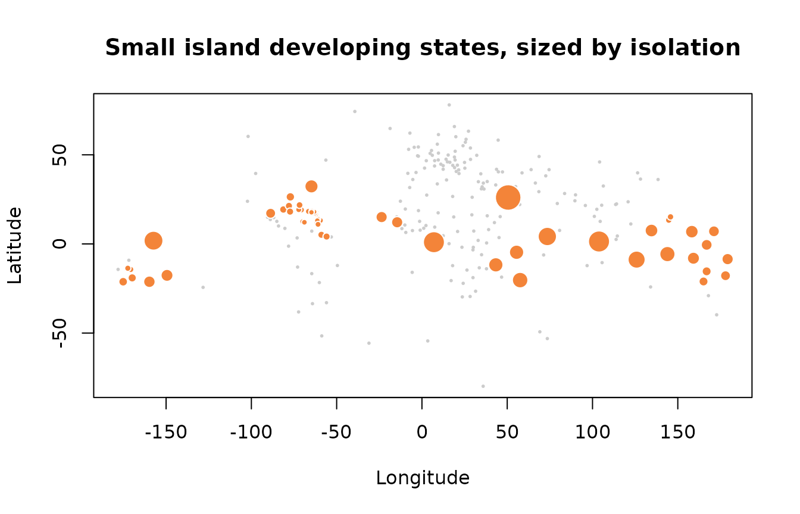

# Profiling the world's small island developing states

The intro vignette shows the mechanics. This one works a small analysis
end to end, using nothing but the bundled `islands` data and the package
helpers, to show the kind of reproducible profile `islandcodes` is meant
to make a one-line job rather than a spreadsheet exercise.

``` r

library(islandcodes)
#> 
#> Attaching package: 'islandcodes'
#> The following object is masked from 'package:datasets':
#> 
#>     islands

sids <- islands[islands$is_sids == 1, ]
nrow(sids)
#> [1] 58
```

## Who counts, and under what tier

The UN-DESA list mixes fully sovereign states with non-sovereign
associate members. That distinction is analytically load-bearing: an
associate member sits inside a metropolitan constitutional order and
inherits a fiscal backstop that a sovereign micro-state does not. The
`sids_tier` column keeps the two apart.

``` r

table(sids$sids_tier, useNA = "ifany")
#> 
#> Associate member Sovereign member 
#>               18               40
```

Overlaying the sub-national island jurisdiction axis shows that the two
classifications are related but not identical. Every SIDS associate
member is a SNIJ, but many SNIJs (Bonaire, the French departments) are
not SIDS, because they are constitutionally integrated into the
metropole rather than recognised as distinct jurisdictions.

``` r

table(SIDS_tier = sids$sids_tier, SNIJ = sids$is_snij == 1, useNA = "ifany")
#>                   SNIJ
#> SIDS_tier          FALSE TRUE
#>   Associate member     0   18
#>   Sovereign member    38    2
```

## How the group distributes across the World Bank taxonomy

Joining the SIDS list onto World Bank region and income group, which is
the step that usually means hand-copying from a PDF, is here just a
cross-tab on columns that already travel with the data.

``` r

table(sids$wb_region)
#> 
#>        East Asia & Pacific  Latin America & Caribbean 
#>                         21                         28 
#> Middle East & North Africa              North America 
#>                          1                          1 
#>                 South Asia         Sub-Saharan Africa 
#>                          1                          6

table(sids$wb_income_group)
#> 
#>         High income          Low income Lower-middle income Upper-middle income 
#>                  26                   3                  10                  19
```

The income spread is the point most casual treatments of “SIDS” miss:
the group runs from high-income territories to lower-middle-income
states, so any analysis that treats SIDS as a single development stratum
is averaging across a real gap.

## Isolation, measured rather than asserted

“Remote” is asserted about small islands far more often than it is
measured. With coordinates and a distance helper it becomes a computed
quantity. For each SIDS with a known landmass point, take the
great-circle distance to its nearest other SIDS.

``` r

sids_geo <- sids[!is.na(sids$latitude), ]
codes    <- sids_geo$iso_code

D <- island_distance(codes)          # symmetric matrix of km
diag(D) <- NA                        # ignore self-distance
sids_geo$nearest_sids_km <- round(apply(D, 1, min, na.rm = TRUE))
```

The ranking is a reminder that “distance to the nearest SIDS” measures
clustering, not absolute remoteness. The top of the list mixes oceans:
Bahrain in the Gulf and Singapore in Southeast Asia are not remote in
any everyday sense, yet their nearest fellow SIDS is thousands of
kilometres away, and they sit alongside genuinely oceanic cases such as
São Tomé and Príncipe and Kiribati that are isolated for the opposite
reason.

``` r

ord <- order(sids_geo$nearest_sids_km, decreasing = TRUE)
head(sids_geo[ord, c("label", "wb_region", "nearest_sids_km")], 10)
#>                     label                  wb_region nearest_sids_km
#> 18                Bahrain Middle East & North Africa            3449
#> 202             Singapore        East Asia & Pacific            2691
#> 196 São Tomé and Príncipe         Sub-Saharan Africa            2682
#> 118              Kiribati        East Asia & Pacific            2322
#> 136              Maldives                 South Asia            2231
#> 224           Timor-Leste        East Asia & Pacific            2021
#> 142             Mauritius         Sub-Saharan Africa            1752
#> 173      Papua New Guinea        East Asia & Pacific            1704
#> 50                Comoros         Sub-Saharan Africa            1550
#> 200            Seychelles         Sub-Saharan Africa            1550
```

At the other end sit the tightly packed Lesser Antilles, where the
nearest peer is a short hop away: Anguilla and Sint Maarten are 23 km
apart.

``` r

head(sids_geo[order(sids_geo$nearest_sids_km),
              c("label", "wb_region", "nearest_sids_km")], 10)
#>                        label                 wb_region nearest_sids_km
#> 8                   Anguilla Latin America & Caribbean              23
#> 204             Sint Maarten Latin America & Caribbean              23
#> 245 Virgin Islands (British) Latin America & Caribbean              77
#> 246    Virgin Islands (U.S.) Latin America & Caribbean              77
#> 10       Antigua and Barbuda Latin America & Caribbean              80
#> 150               Montserrat Latin America & Caribbean              80
#> 140               Martinique Latin America & Caribbean              83
#> 190              Saint Lucia Latin America & Caribbean              83
#> 90                Guadeloupe Latin America & Caribbean              84
#> 189    Saint Kitts and Nevis Latin America & Caribbean              85
```

A base-R map makes the two regimes visible at once: the whole reference
set in grey, SIDS overplotted, sized by isolation.

``` r

plot(islands$longitude, islands$latitude,
     pch = 16, cex = 0.4, col = "grey80",
     xlab = "Longitude", ylab = "Latitude",
     main = "Small island developing states, sized by isolation")
points(sids_geo$longitude, sids_geo$latitude,
       pch = 21, bg = "#f38439", col = "white",
       cex = 0.6 + 2.4 * (sids_geo$nearest_sids_km / max(sids_geo$nearest_sids_km)))
```



## From nearest neighbour to access

Distance to the nearest peer is a blunt instrument. It throws away every
observation but one, so an island with a single close neighbour and
nothing else within an ocean scores identically to one sitting inside a
dense archipelago. The economic geography literature, and the recent
remote-sensing work on rural connectivity that borrows from it, uses a
decayed sum over all destinations instead: access is mass discounted by
distance, summed.

[`island_market_access()`](https://university-of-aruba.github.io/islandcodes/reference/island_market_access.md)
implements that. The package deliberately does not ship the mass.
Population and output are time-varying and contested, so the figures and
their reference year stay the analyst’s responsibility. With unit mass
the function reduces to a pure peer-accessibility index, which needs no
external data and isolates what the functional form alone contributes.

``` r

sids_geo$access <- island_market_access(
  codes,
  mass  = rep(1, length(codes)),   # unit mass: proximity to peers, nothing else
  theta = 1
)
```

The ranking is Caribbean from top to bottom. All twenty highest-access
SIDS sit in the Lesser and Greater Antilles, which is the densest
concentration of island jurisdictions anywhere on the planet.

``` r

ord_a <- order(sids_geo$access, decreasing = TRUE)
head(sids_geo[ord_a, c("label", "wb_region", "nearest_sids_km", "access")], 10)
#>                     label                 wb_region nearest_sids_km     access
#> 204          Sint Maarten Latin America & Caribbean              23 0.11118117
#> 8                Anguilla Latin America & Caribbean              23 0.10708402
#> 150            Montserrat Latin America & Caribbean              80 0.08761425
#> 189 Saint Kitts and Nevis Latin America & Caribbean              85 0.08741834
#> 90             Guadeloupe Latin America & Caribbean              84 0.08096295
#> 10    Antigua and Barbuda Latin America & Caribbean              80 0.08017072
#> 63               Dominica Latin America & Caribbean              92 0.07605030
#> 140            Martinique Latin America & Caribbean              83 0.07427292
#> 190           Saint Lucia Latin America & Caribbean              83 0.07289836
#> 246 Virgin Islands (U.S.) Latin America & Caribbean              77 0.06774878

table(sids_geo$wb_region[ord_a][1:20])
#> 
#> Latin America & Caribbean 
#>                        20
```

Set against the nearest-neighbour column it is close to a mirror image,
and the Spearman correlation says so. That is worth stating plainly
rather than dressing up: at this level the two measures mostly agree,
and access does not overturn the isolation ranking.

``` r

cor(sids_geo$nearest_sids_km, sids_geo$access, method = "spearman")
#> [1] -0.9492339
```

What access buys is not a different answer but a better-behaved one.
Nearest-neighbour distance is a single-observation statistic: it is
determined entirely by one peer, so it jumps discontinuously when that
peer is added to or dropped from the reference set, and it cannot
distinguish Sint Maarten, which has one neighbour at 23 km and thirty
more within 1,000 km, from a pair of islands alone in an ocean. Access
uses every destination and moves smoothly.

The decay elasticity is a modelling choice, not a fact, so it needs a
sensitivity check rather than a silent default. Here the ordering turns
out to be robust: rank correlation between `theta = 0.5` and `theta = 2`
is above 0.97, and only six of the fifty-eight territories move more
than five places.

``` r

r <- sapply(c(0.5, 1, 2), function(th) {
  rank(-island_market_access(codes, rep(1, length(codes)), theta = th))
})
colnames(r) <- c("theta_0.5", "theta_1", "theta_2")
cor(r[, "theta_0.5"], r[, "theta_2"], method = "spearman")
#> [1] 0.9720078
```

The movement that does happen is concentrated in one place, and it is
substantive rather than numerical noise. Guam and the Northern Mariana
Islands climb fifteen and sixteen places as `theta` rises, because they
are a tight pair inside an otherwise empty stretch of the western
Pacific. That is exactly what a decay parameter encodes: how much a
close cluster compensates for global remoteness. An analyst who reports
one ranking under one unstated `theta` has hidden that judgement rather
than made it.

``` r

moved <- data.frame(label = sids_geo$label, r,
                    move = abs(r[, "theta_0.5"] - r[, "theta_2"]))
head(moved[order(moved$move, decreasing = TRUE), ], 6)
#>                       label theta_0.5 theta_1 theta_2 move
#> MP Northern Mariana Islands        45      36      29   16
#> GU                     Guam        43      35      28   15
#> AS           American Samoa        30      29      22    8
#> WS                    Samoa        31      30      23    8
#> BZ                   Belize        29      31      35    6
#> BM                  Bermuda        28      28      34    6
```

With real mass the measure changes character, because access stops being
about how many neighbours there are and becomes about who they are. Here
the Dutch Caribbean six, using illustrative population in thousands:
substitute sourced figures and cite the year in real work.

``` r

pop <- c(AW = 108, CW = 156, SX = 43, "BQ-BO" = 25, "BQ-SE" = 3, "BQ-SA" = 2)
sort(round(island_market_access(names(pop), pop), 3), decreasing = TRUE)
#> BQ-BO    AW BQ-SA    CW BQ-SE    SX 
#> 2.759 1.464 1.304 1.284 1.081 0.403
```

Bonaire tops the within-Kingdom ranking because it sits between the two
population centres of the ABC group, and Sint Maarten comes last despite
being the busiest of the SSS islands, because its only near neighbours
are the two smallest territories in the set. The spread is a factor of
seven from top to bottom.

Widen the destination set to the surrounding mainland economies and that
internal structure almost disappears. The six collapse into two flat
tiers, ABC and SSS, about twenty per cent apart, and within each tier
the differences are negligible.

``` r

region <- c(US = 335000, CO = 52000, VE = 28000, DO = 11000, PR = 3200)
sort(round(island_market_access(names(pop), region, to = names(region)), 2),
     decreasing = TRUE)
#>     CW  BQ-BO     AW  BQ-SA     SX  BQ-SE 
#> 185.70 185.56 184.07 155.66 154.04 154.01
```

The two tables answer different questions. Relative position inside the
Kingdom is governed by which islands you are next to; access to the
world outside it is governed only by which side of the Caribbean you sit
on, and the intra-group distances that dominate the first table are too
small to matter in the second.

## What these distances are, and what they are not

Every number above rests on one great-circle distance between two
points, and that construction has limits worth stating before anyone
builds on it.

The coordinates are a single representative point per territory. For a
compact island that is unambiguous. For a dispersed archipelago it is
not: French Polynesia spans some 2,000 km of ocean, and a representative
point for it is a convention, not a location. Where the distinction
matters, `which = "capital"` gives the alternative anchor, and the two
can differ by hundreds of kilometres.

``` r

island_coords("French Polynesia")
#>              label iso_code latitude longitude
#> 1 French Polynesia       PF -17.6281 -149.4616
island_coords("French Polynesia", which = "capital")
#>              label iso_code capital latitude longitude
#> 1 French Polynesia       PF Papeete -17.5334 -149.5667
```

Great-circle distance is not travel distance and is emphatically not
travel cost. Between two islands there is no road; there is a ferry
schedule, an air route with a hub in between, and a container rotation,
each with its own geometry. Aruba to Sint Maarten is about 900 km as the
crow flies and a connection through a third country in practice. The
same caution applies to the market-access numbers: they are a geographic
accessibility measure, and calling them market access in the economic
sense requires the reader to accept distance as a stand-in for cost.
Where actual travel times or freight rates exist, join them onto these
codes and use those instead. That is what the package is for.

Nor does a single point capture internal geography. Two territories of
equal area and equal distance from everything else can differ sharply in
how their own population is distributed relative to a port, which is
exactly the variation the satellite-based literature on rural market
access is built to measure and which a centroid cannot see.

Finally, a handful of territories carry no coordinate at all and
propagate as `NA` rather than being silently dropped: the representative
point is missing for the United States Minor Outlying Islands, and
capitals are missing for the uninhabited and capital-less entries.
Checking for those is a step, not an afterthought.

``` r

sum(is.na(islands$latitude))
#> [1] 1
sum(is.na(islands$capital_latitude))
#> [1] 8
```

## The Dutch Caribbean as a stress test of the coding scheme

The Kingdom of the Netherlands is a compact illustration of why the
disambiguation matters. It comprises seven entities: the European
metropole and six Caribbean territories, which the dataset returns in
one filter. They span both classifications, and the Caribbean six are
split geographically into the ABC islands off Venezuela and the SSS
islands some 900 km to the northeast.

``` r

dc <- islands[islands$political_association == "Dutch Kingdom",
              c("label", "iso_code", "sids_tier", "is_snij")]
dc
#>              label iso_code        sids_tier is_snij
#> 13           Aruba       AW Associate member       1
#> 28         Bonaire    BQ-BO             <NA>       1
#> 58         Curaçao       CW Associate member       1
#> 157    Netherlands       NL             <NA>       0
#> 186           Saba    BQ-SA             <NA>       1
#> 203 Sint Eustatius    BQ-SE             <NA>       1
#> 204   Sint Maarten       SX Associate member       1

# ABC-to-SSS separation, from Aruba
island_distance("AW", c("Sint Maarten", "Saba", "Sint Eustatius"))
#>       SX    BQ-SA    BQ-SE 
#> 961.7026 919.9918 932.9875
```

The Netherlands row earns its place by contrast: it is the only one that
is not a sub-national island jurisdiction and carries no SIDS tier. The
three constituent countries (Aruba, Curaçao, Sint Maarten) are
associate-member SIDS, while Bonaire, Sint Eustatius, and Saba are
special municipalities of the Netherlands proper, so they read as SNIJ
but not SIDS. A country-code package that collapses those three into a
single `BQ` row cannot produce this table at all: half the Caribbean
territories would vanish or merge. That is the class of silent error the
package exists to remove, and the reason the analysis above is
reproducible from a single bundled dataset rather than a chain of manual
joins.
